> **__NOTE__**: This document is translated with AI assistance

# Unicorn-Engine API Documentation

| Version | 2.0.0 |
| ------- | ----- |

**Official API document by [kabeor](https://github.com/kabeor)**

[PDF File](https://github.com/kabeor/Micro-Unicorn-Engine-API-Documentation) 

[Unicorn Engine](http://www.unicorn-engine.org/)은 경량, 다중 플랫폼, 다중 아키텍처의 CPU 에뮬레이터 프레임워크로, 현재 버전은 [Qemu](https://www.qemu.org/) 5.0.1을 기반으로 개발되었습니다. 이는 CPU 에뮬레이션 코드의 실행을 대체할 수 있으며, 주로 프로그램 가상화, 악성 코드 분석, Fuzzing 등에 사용됩니다. 이 프로젝트는 [Qiling 가상화 프레임워크](https://github.com/qilingframework/qiling), [Radare2 리버스 엔지니어링 프레임워크](https://github.com/qilingframework/qiling), [GEF(gdb의 pwn 분석 플러그인)](https://github.com/hugsy/gef), [Pwndbg](https://github.com/pwndbg/pwndbg), [Angr 심볼릭 실행 프레임워크](https://github.com/angr/angr) 등 여러 유명 프로젝트에서 사용되고 있습니다.

## 0x0 개발 준비

Unicorn웹사이트:     http://www.unicorn-engine.org

```bash
git clone https://github.com/unicorn-engine/unicorn.git
```

### 빌드

<details><summary>Linux & MacOS</summary>

Ubuntu
```bash
sudo apt install cmake pkg-config
```

MacOS
```bash
brew install cmake pkg-config
```

다음 명령을 사용하여 컴파일하십시오.
```bash
mkdir build; cd build
cmake .. -DCMAKE_BUILD_TYPE=Release
make
```
</details>

<details><summary>Windows</summary>

Microsoft MSVC 컴파일러로 컴파일
```bash
// cmake 및 Microsoft Visual Studio (>=16.8) 설치
// Visual Studio Command Prompt에서 다음 명령을 사용하여 컴파일
mkdir build; cd build
cmake .. -G "NMake Makefiles" -DCMAKE_BUILD_TYPE=Release
nmake
```

<details><summary>VS GUI에서 lib와 dll 컴파일 (구 버전)</summary>

소스코드： https://github.com/unicorn-engine/unicorn/archive/master.zip

다운로드 후 압축 해제

파일 구조는 다음과 같습니다:

```
. <- 주요 엔진 core engine + README + 컴파일 문서 COMPILE.TXT 등
├── bindings <- 바인딩
│ ├── dotnet <- .Net 바인딩 + 테스트 코드
│ ├── go <- go 바인딩 + 테스트 코드
│ ├── haskell <- Haskell 바인딩 + 테스트 코드
│ ├── java <- Java 바인딩 + 테스트 코드
│ ├── pascal <- Pascal 바인딩 + 테스트 코드
│ ├── python <- Python 바인딩 + 테스트 코드
│ ├── ruby <- Ruby 바인딩 + 테스트 코드
│ ├── rust <- Rust 바인딩 + 테스트 코드
│ └── vb6 <- VB6 바인딩 + 테스트 코드
├── docs <- 문서
├── glib_compat <- glib 2.64.4 기반으로 수정된 호환 라이브러리
├── include <- C 헤더 파일
├── msvc <- Microsoft Visual Studio 지원 (Windows)
├── qemu <- 수정된 qemu 소스 코드
├── samples <- Unicorn 사용 예제
└── tests <- C 언어 테스트 케이스
```

아래는 Windows 10에서 Visual Studio 2019를 사용하여 컴파일하는 방법입니다.

msvc 폴더를 열면 내부 구조는 다음과 같습니다.

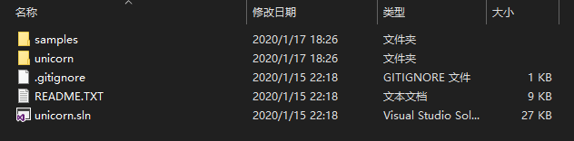

Visual Studio에서 unicorn.sln 프로젝트 파일을 열면, 솔루션이 자동으로 다음 항목들을 로드합니다.

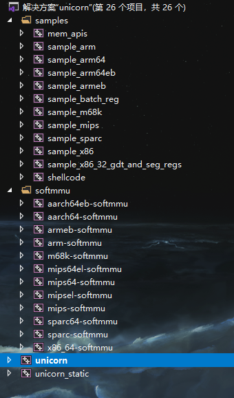

모든 항목이 필요하다면, 바로 컴파일하면 됩니다. 일부 항목만 필요하다면, 솔루션을 마우스 오른쪽 버튼으로 클릭 -> 속성 -> 구성 속성 -> 빌드 옵션에서 필요한 지원 항목을 선택하면 됩니다.

또한, 시작 프로젝트에서 여러 프로젝트를 구성할 수 있습니다. 아래와 같이 설정하십시오.

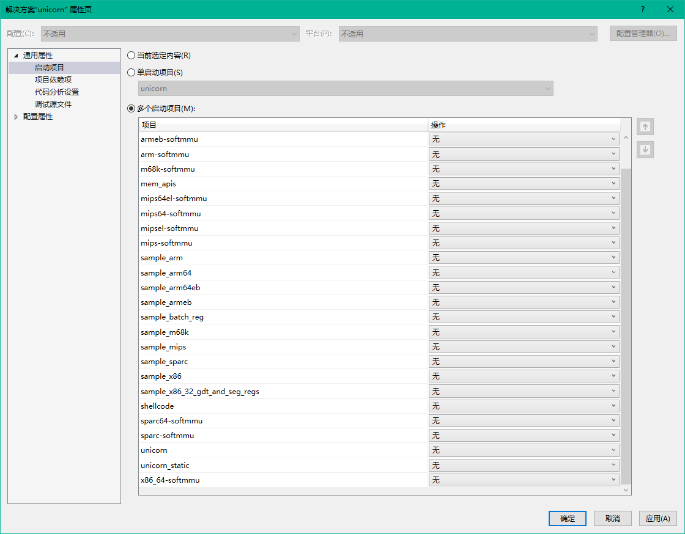

컴파일 후 현재 폴더의 Debug 디렉토리에 unicorn.lib 정적 라이브러리와 unicorn.dll 동적 라이브러리가 생성됩니다. 이렇게 하면 Unicorn을 사용한 개발을 시작할 수 있습니다.

공식적으로 제공되는 최신 컴파일된 버전은 1.0.3 버전이며, 최신 버전의 소스를 직접 편집하여 더 많은 사용 가능한 API를 얻을 수 있습니다.

> Win32：https://github.com/unicorn-engine/unicorn/releases/download/2.0.0/unicorn-2.0.0-win32.zip

> Win64：https://github.com/unicorn-engine/unicorn/releases/download/2.0.0/unicorn-2.0.0-win64.zip

**주의: x32 또는 x64를 선택하면 이후 개발의 아키텍처에 영향을 미칩니다**

컴파일을 클릭한 후, unicorn\msvc\x32 또는 x64\Debug 또는 Release 디렉토리에서 unicorn.dll과 unicorn.lib를 찾으면 됩니다.

</details>
</details>

> 다른 컴파일 방법은 [여기](https://github.com/unicorn-engine/unicorn/blob/master/docs/COMPILE.md)를 클릭하세요.

### 설치
- Python모듈
``` bash
pip install unicorn

//1.x 버전을 설치한 경우, 다음 명령을 통해 직접 업그레이드할 수 있습니다.
pip install unicorn --upgrade
```

- MacOS HomeBrew패키지
```bash
brew install unicorn
```

### 엔진 호출 테스트
(Windows VS2019을 예로 들었습니다)

1. 새 VS 프로젝트를 생성합니다.
2. ..\unicorn-master\include\unicorn 폴더에 있는 헤더 파일과 컴파일된 lib 및 dll 파일을 새 프로젝트의 주 디렉토리로 복사합니다.

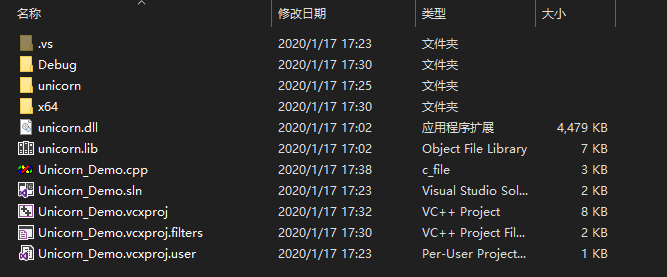

VS 솔루션에서 다음 단계를 수행합니다:

1. 헤더 파일에 기존 항목으로 `unicorn.h`를 추가합니다.
2. 리소스 파일에 `unicorn.lib`를 추가합니다.
3. 솔루션을 다시 빌드합니다.

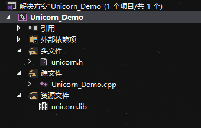

이제 생성한 Unicorn 엔진을 테스트해봅시다.

메인 파일 코드는 다음과 같습니다:

<details><summary> Code </summary>

```cpp
#include <iostream>
#include "unicorn/unicorn.h"

// 에뮬레이션할 명령
#define X86_CODE32 "\x41\x4a" // INC ecx; DEC edx

// 시작 주소
#define ADDRESS 0x1000000

int main()
{
    uc_engine* uc;
    uc_err err;
    int r_ecx = 0x1234;     // ECX 레지스터
    int r_edx = 0x7890;     // EDX 레지스터

    printf("Emulate i386 code\n");

    // X86-32bit 모드 초기화 에뮬레이션
    err = uc_open(UC_ARCH_X86, UC_MODE_32, &uc);
    if (err != UC_ERR_OK) {
        printf("Failed on uc_open() with error returned: %u\n", err);
        return -1;
    }

    // 에뮬레이터에 2MB 메모리 할당
    uc_mem_map(uc, ADDRESS, 2 * 1024 * 1024, UC_PROT_ALL);

    // 에뮬레이션할 명령을 메모리에 씀
    if (uc_mem_write(uc, ADDRESS, X86_CODE32, sizeof(X86_CODE32) - 1)) {
        printf("Failed to write emulation code to memory, quit!\n");
        return -1;
    }

    // 레지스터 초기화
    uc_reg_write(uc, UC_X86_REG_ECX, &r_ecx);
    uc_reg_write(uc, UC_X86_REG_EDX, &r_edx);

    printf(">>> ECX = 0x%x\n", r_ecx);
    printf(">>> EDX = 0x%x\n", r_edx);

     // 명령어 에뮬레이션
    err = uc_emu_start(uc, ADDRESS, ADDRESS + sizeof(X86_CODE32) - 1, 0, 0);
    if (err) {
        printf("Failed on uc_emu_start() with error returned %u: %s\n",
        err, uc_strerror(err));
    }

    // 레지스터 값 출력
    printf("Emulation done. Below is the CPU context\n");

    uc_reg_read(uc, UC_X86_REG_ECX, &r_ecx);
    uc_reg_read(uc, UC_X86_REG_EDX, &r_edx);
    printf(">>> ECX = 0x%x\n", r_ecx);
    printf(">>> EDX = 0x%x\n", r_edx);

    uc_close(uc);

    return 0;
}
```

</details>


실행 결과는 다음과 같습니다.

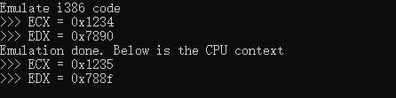

ECX +1과 EDX -1이 성공적으로 에뮬레이션되었습니다.

## 0x1 데이터 타입

### 차례

[uc_arch](#uc_arch)

[uc_mode](#uc_mode)

[uc_err](#uc_err)

[uc_mem_type](#uc_mem_type)

[uc_hook_type](#uc_hook_type)

[Hook Types](#hook_types)

[uc_mem_region](#uc_mem_region)

[uc_query_type](#uc_query_type)

[uc_control_type](#uc_control_type)

[uc_context](#uc_context)

[uc_prot](#uc_prot)

---

### uc_arch

아키텍처 선택

<details><summary> Code </summary>

```cpp
typedef enum uc_arch {
    UC_ARCH_ARM = 1,    // ARM 아키텍처 (Thumb, Thumb-2 포함)
    UC_ARCH_ARM64,      // ARM-64, AArch64라고도 함
    UC_ARCH_MIPS,       // MIPS 아키텍처
    UC_ARCH_X86,        // X86 아키텍처 (x86 및 x86-64 포함)
    UC_ARCH_PPC,        // PowerPC 아키텍처
    UC_ARCH_SPARC,      // SPARC 아키텍처
    UC_ARCH_M68K,       // M68K 아키텍처
    UC_ARCH_RISCV,      // RISCV 아키텍처
    UC_ARCH_S390X,      // S390X 아키텍처
    UC_ARCH_TRICORE,    // TriCore 아키텍처
    UC_ARCH_MAX,
} uc_arch;
```

</details>

### uc_mode

모드 선택

<details><summary> Code </summary>

```cpp
typedef enum uc_mode {
    UC_MODE_LITTLE_ENDIAN = 0,    // 리틀 엔디안 모드 (기본값)
    UC_MODE_BIG_ENDIAN = 1 << 30, // 빅 엔디안 모드

    // arm / arm64
    UC_MODE_ARM = 0,              // ARM 모드
    UC_MODE_THUMB = 1 << 4,       // THUMB 모드 (Thumb-2 포함)
    
    // 폐기됨, UC_ARM_CPU_* 및 uc_ctl로 전환
    UC_MODE_MCLASS = 1 << 5,      // ARM의 Cortex-M 시리즈
    UC_MODE_V8 = 1 << 6,          // ARMv8 A32 인코딩
    UC_MODE_ARMBE8 = 1 << 10, // 빅 엔디안 데이터와 리틀 엔디안 코드, UC1 버전과의 호환성을 위해

    // arm (32bit) CPU 타입
    // 폐기됨, UC_ARM_CPU_* 및 uc_ctl로 전환
    UC_MODE_ARM926 = 1 << 7,	  // ARM926 CPU 타입
    UC_MODE_ARM946 = 1 << 8,	  // ARM946 CPU 타입
    UC_MODE_ARM1176 = 1 << 9,	  // ARM1176 CPU 타입

    // mips
    UC_MODE_MICRO = 1 << 4,       // MicroMips 모드 (지원되지 않음)
    UC_MODE_MIPS3 = 1 << 5,       // Mips III ISA (지원되지 않음)
    UC_MODE_MIPS32R6 = 1 << 6,    // Mips32r6 ISA (지원되지 않음)
    UC_MODE_MIPS32 = 1 << 2,      // Mips32 ISA
    UC_MODE_MIPS64 = 1 << 3,      // Mips64 ISA

    // x86 / x64
    UC_MODE_16 = 1 << 1,          // 16비트 모드
    UC_MODE_32 = 1 << 2,          // 32비트 모드
    UC_MODE_64 = 1 << 3,          // 64비트 모드

    // ppc
    UC_MODE_PPC32 = 1 << 2,       // 32비트 모드
    UC_MODE_PPC64 = 1 << 3,       // 64비트 모드 (지원되지 않음)
    UC_MODE_QPX = 1 << 4,         // Quad Processing eXtensions 모드 (지원되지 않음)

    // sparc
    UC_MODE_SPARC32 = 1 << 2,     // 32비트 모드
    UC_MODE_SPARC64 = 1 << 3,     // 64비트 모드
    UC_MODE_V9 = 1 << 4,          // SparcV9 모드 (지원되지 않음)

    // riscv
    UC_MODE_RISCV32 = 1 << 2,     // 32비트 모드
    UC_MODE_RISCV64 = 1 << 3,     // 64비트 모드

    // m68k
} uc_mode;
```

</details>


### uc_err

오류 유형, 이는 [uc_errno()](#uc_errno)의 반환 값입니다.

<details><summary> Code </summary>

```cpp
typedef enum uc_err {
    UC_ERR_OK = 0,           // 오류 없음
    UC_ERR_NOMEM,            // 메모리 부족: uc_open(), uc_emulate()
    UC_ERR_ARCH,             // 지원되지 않는 아키텍처: uc_open()
    UC_ERR_HANDLE,           // 사용 불가능한 핸들
    UC_ERR_MODE,             // 사용 불가능/지원되지 않는 아키텍처: uc_open()
    UC_ERR_VERSION,          // 지원되지 않는 버전 (또는 언어 바인딩)
    UC_ERR_READ_UNMAPPED,    // 맵핑되지 않은 메모리에서 읽기 때문에 에뮬레이션 종료: uc_emu_start()
    UC_ERR_WRITE_UNMAPPED,   // 맵핑되지 않은 메모리에 쓰기 때문에 에뮬레이션 종료: uc_emu_start()
    UC_ERR_FETCH_UNMAPPED,   // 맵핑되지 않은 메모리에서 데이터 가져오기 때문에 에뮬레이션 종료: uc_emu_start()
    UC_ERR_HOOK,             // 잘못된 훅 타입: uc_hook_add()
    UC_ERR_INSN_INVALID,     // 잘못된 명령어 때문에 에뮬레이션 종료: uc_emu_start()
    UC_ERR_MAP,              // 잘못된 메모리 맵핑: uc_mem_map()
    UC_ERR_WRITE_PROT,       // UC_MEM_WRITE_PROT 충돌 때문에 에뮬레이션 중지: uc_emu_start()
    UC_ERR_READ_PROT,        // UC_MEM_READ_PROT 충돌 때문에 에뮬레이션 중지: uc_emu_start()
    UC_ERR_FETCH_PROT,       // UC_MEM_FETCH_PROT 충돌 때문에 에뮬레이션 중지: uc_emu_start()
    UC_ERR_ARG,              // uc_xxx 함수에 제공된 잘못된 인수
    UC_ERR_READ_UNALIGNED,   // 정렬되지 않은 읽기
    UC_ERR_WRITE_UNALIGNED,  // 정렬되지 않은 쓰기
    UC_ERR_FETCH_UNALIGNED,  // 정렬되지 않은 가져오기
    UC_ERR_HOOK_EXIST,       // 이 이벤트에 대한 훅이 이미 존재함
    UC_ERR_RESOURCE,         // 자원 부족: uc_emu_start()
    UC_ERR_EXCEPTION,        // 처리되지 않은 CPU 예외
} uc_err;
```

</details>


### uc_mem_type

UC_HOOK_MEM_*의 모든 메모리 접근 유형

<details><summary> Code </summary>

```cpp
typedef enum uc_mem_type {
    UC_MEM_READ = 16,        // 메모리에서..읽기
    UC_MEM_WRITE,            // 메모리에 쓰기..
    UC_MEM_FETCH,            // 메모리에서 가져오기
    UC_MEM_READ_UNMAPPED,    // 맵핑되지 않은 메모리에서..읽기
    UC_MEM_WRITE_UNMAPPED,   // 맵핑되지 않은 메모리에 쓰기..
    UC_MEM_FETCH_UNMAPPED,   // 맵핑되지 않은 메모리에서 가져오기
    UC_MEM_WRITE_PROT,       // 메모리 쓰기 보호, 하지만 맵핑됨
    UC_MEM_READ_PROT,        // 메모리 읽기 보호, 하지만 맵핑됨
    UC_MEM_FETCH_PROT,       // 메모리 실행 불가, 하지만 맵핑됨
    UC_MEM_READ_AFTER,       // 메모리에서 (성공적으로 접근된 주소에서) 읽기
} uc_mem_type;
```

</details>


### uc_hook_type

[uc_hook_add()](#uc_hook_add)的所有hook类型参数

<details><summary> Code </summary>

```cpp
typedef enum uc_hook_type {
    // Hook 所有中断/syscall 事件
    UC_HOOK_INTR = 1 << 0,
    // Hook 一条特定的指令 - 只支持非常小的指令子集
    UC_HOOK_INSN = 1 << 1,
    // Hook 一段代码
    UC_HOOK_CODE = 1 << 2,
    // Hook 基本块
    UC_HOOK_BLOCK = 1 << 3,
    // 用于在未映射的内存上读取内存的Hook
    UC_HOOK_MEM_READ_UNMAPPED = 1 << 4,
    // Hook 无效的内存写事件
    UC_HOOK_MEM_WRITE_UNMAPPED = 1 << 5,
    // Hook 执行事件的无效内存
    UC_HOOK_MEM_FETCH_UNMAPPED = 1 << 6,
    // Hook 读保护的内存
    UC_HOOK_MEM_READ_PROT = 1 << 7,
    // Hook 写保护的内存
    UC_HOOK_MEM_WRITE_PROT = 1 << 8,
    // Hook 不可执行内存上的内存
    UC_HOOK_MEM_FETCH_PROT = 1 << 9,
    // Hook 内存读取事件
    UC_HOOK_MEM_READ = 1 << 10,
    // Hook 内存写入事件
    UC_HOOK_MEM_WRITE = 1 << 11,
    // Hook 内存获取执行事件
    UC_HOOK_MEM_FETCH = 1 << 12,
    // Hook 内存读取事件，只允许能成功访问的地址
    // 成功读取后将触发回调
    UC_HOOK_MEM_READ_AFTER = 1 << 13,
    // Hook 无效指令异常
    UC_HOOK_INSN_INVALID = 1 << 14,
    // Hook 新的(执行流的)边生成事件. 在程序分析中可能有用.
    // 注意: 该Hook有两个方面不同于 UC_HOOK_BLOCK:
    //       1. 该Hook在指令执行前被调用.
    //       2. 该Hook仅在生成事件触发时被调用.
    UC_HOOK_EDGE_GENERATED = 1 << 15,
    // Hook 特定的 tcg 操作码. 用法与UC_HOOK_INSN相似.
    UC_HOOK_TCG_OPCODE = 1 << 16,
} uc_hook_type;
```

</details>


### hook_types

宏定义Hook类型

<details><summary> Code </summary>

```cpp
// Hook 所有未映射内存访问的事件
#define UC_HOOK_MEM_UNMAPPED (UC_HOOK_MEM_READ_UNMAPPED + UC_HOOK_MEM_WRITE_UNMAPPED + UC_HOOK_MEM_FETCH_UNMAPPED)
// Hook 所有对受保护内存的非法访问事件
#define UC_HOOK_MEM_PROT (UC_HOOK_MEM_READ_PROT + UC_HOOK_MEM_WRITE_PROT + UC_HOOK_MEM_FETCH_PROT)
// Hook 所有非法读取存储器的事件
#define UC_HOOK_MEM_READ_INVALID (UC_HOOK_MEM_READ_PROT + UC_HOOK_MEM_READ_UNMAPPED)
// Hook 所有非法写入存储器的事件
#define UC_HOOK_MEM_WRITE_INVALID (UC_HOOK_MEM_WRITE_PROT + UC_HOOK_MEM_WRITE_UNMAPPED)
// Hook 所有非法获取内存的事件
#define UC_HOOK_MEM_FETCH_INVALID (UC_HOOK_MEM_FETCH_PROT + UC_HOOK_MEM_FETCH_UNMAPPED)
// Hook 所有非法的内存访问事件
#define UC_HOOK_MEM_INVALID (UC_HOOK_MEM_UNMAPPED + UC_HOOK_MEM_PROT)
// Hook 所有有效内存访问的事件
// 注意: UC_HOOK_MEM_READ 在 UC_HOOK_MEM_READ_PROT 和 UC_HOOK_MEM_READ_UNMAPPED 之前触发 ,
//       因此这个Hook可能会触发一些无效的读取。
#define UC_HOOK_MEM_VALID (UC_HOOK_MEM_READ + UC_HOOK_MEM_WRITE + UC_HOOK_MEM_FETCH)
```

</details>


### uc_mem_region

由[uc_mem_map()](#uc_mem_map)和[uc_mem_map_ptr()](#uc_mem_map_ptr)映射内存区域
使用[uc_mem_regions()](#uc_mem_regions)检索该内存区域的列表

<details><summary> Code </summary>

```cpp
typedef struct uc_mem_region {
    uint64_t begin; // 区域起始地址 (包括)
    uint64_t end;   // 区域结束地址 (包括)
    uint32_t perms; // 区域的内存权限
} uc_mem_region;
```

</details>


### uc_query_type

[uc_query()](#uc_query)的所有查询类型参数

<details><summary> Code </summary>

```cpp
typedef enum uc_query_type {
    // 动态查询当前硬件模式
    UC_QUERY_MODE = 1,
    UC_QUERY_PAGE_SIZE, // 查询引擎实例的pagesize
    UC_QUERY_ARCH,      // 查询引擎实例的架构类型
    UC_QUERY_TIMEOUT,   // 查询是否由于超时停止模拟 (如果 result = True 则表示是)
} uc_query_type;
```

</details>


### uc_control_type

[uc_ctl()](#uc_ctl)的所有查询类型参数

<details><summary> Code </summary>

```cpp
// uc_ctl 的实现与 Linux ioctl 较为类似但略有不同
//
// uc_control_type 在 uc_ctl 中的组织结构如下:
//
//    R/W       NR       Reserved     Type
//  [      ] [      ]  [         ] [       ]
//  31    30 29     26 25       16 15      0
//
//  @R/W: 是否操作是一个读/写访问.
//  @NR: 参数数量.
//  @Reserved: 为0，为未来扩展保留.
//  @Type: uc_control_type 中的枚举.

// 无输入和输出参数.
#define UC_CTL_IO_NONE (0)
// 仅有输入参数为了一个写操作.
#define UC_CTL_IO_WRITE (1)
// 仅有输出参数为了一个读操作.
#define UC_CTL_IO_READ (2)
// 参数中同时包含读和写操作.
#define UC_CTL_IO_READ_WRITE (UC_CTL_IO_WRITE | UC_CTL_IO_READ)

#define UC_CTL(type, nr, rw)                                                   \
    (uc_control_type)((type) | ((nr) << 26) | ((rw) << 30))
#define UC_CTL_NONE(type, nr) UC_CTL(type, nr, UC_CTL_IO_NONE)
#define UC_CTL_READ(type, nr) UC_CTL(type, nr, UC_CTL_IO_READ)
#define UC_CTL_WRITE(type, nr) UC_CTL(type, nr, UC_CTL_IO_WRITE)
#define UC_CTL_READ_WRITE(type, nr) UC_CTL(type, nr, UC_CTL_IO_READ_WRITE)
```

```cpp
// 控制链以树状结构组织.
// 如果一个控制状态没有为@args填入 `Set` 或 `Get`, 则是 r/o 或 w/o.
typedef enum uc_control_type {
    // 当前模式.
    // Read: @args = (int*)
    UC_CTL_UC_MODE = 0,
    // 当前 page size.
    // Write: @args = (uint32_t)
    // Read: @args = (uint32_t*)
    UC_CTL_UC_PAGE_SIZE,
    // 当前架构.
    // Read: @args = (int*)
    UC_CTL_UC_ARCH,
    // 当前超时.
    // Read: @args = (uint64_t*)
    UC_CTL_UC_TIMEOUT,
    // 允许存在多个退出点.
    // 没有该控制状态, 读取/设置退出点将不能使用.
    // Write: @args = (int)
    UC_CTL_UC_USE_EXITS,
    // 当前输入数.
    // Read: @args = (size_t*)
    UC_CTL_UC_EXITS_CNT,
    // 当前输入.
    // Write: @args = (uint64_t* exits, size_t len)
    //        @len = UC_CTL_UC_EXITS_CNT
    // Read: @args = (uint64_t* exits, size_t len)
    //       @len = UC_CTL_UC_EXITS_CNT
    UC_CTL_UC_EXITS,

    // 设置uc实例的cpu模式.
    // Note this option can only be set before any Unicorn
    // API is called except for uc_open.
    // Write: @args = (int)
    // Read:  @args = (int*)
    UC_CTL_CPU_MODEL,
    // 查询特定地址的 tb(翻译块) 缓存
    // Read: @args = (uint64_t, uc_tb*)
    UC_CTL_TB_REQUEST_CACHE,
    // 禁用特定地址的 tb(翻译块) 缓存
    // Write: @args = (uint64_t, uint64_t)
    UC_CTL_TB_REMOVE_CACHE,
    // 禁用所有的 tb(翻译块)
    // 无参数
    UC_CTL_TB_FLUSH

} uc_control_type;
```

</details>


### uc_context

与uc_context_*()一起使用，管理CPU上下文的不透明存储

<details><summary> Code </summary>

```cpp
struct uc_context;
typedef struct uc_context uc_context;
```

</details>


### uc_prot

新映射区域的权限

<details><summary> Code </summary>

```cpp
typedef enum uc_prot {
   UC_PROT_NONE = 0,    //无
   UC_PROT_READ = 1,    //读取
   UC_PROT_WRITE = 2,   //写入
   UC_PROT_EXEC = 4,    //可执行
   UC_PROT_ALL = 7,     //所有权限
} uc_prot;
```

</details>


## 0x2 API

> 索引

[uc_version](#uc_version)

[uc_arch_supported](#uc_arch_supported)

[uc_open](#uc_open)

[uc_close](#uc_close)

[uc_query](#uc_query)

[uc_errno](#uc_errno)

[uc_strerror](#uc_strerror)

[uc_reg_write](#uc_reg_write)

[uc_reg_read](#uc_reg_read)

[uc_reg_write_batch](#uc_reg_write_batch)

[uc_reg_read_batch](#uc_reg_read_batch)

[uc_mem_write](#uc_mem_write)

[uc_mem_read](#uc_mem_read)

[uc_emu_start](#uc_emu_start)

[uc_emu_stop](#uc_emu_stop)

[uc_hook_add](#uc_hook_add)

[uc_hook_del](#uc_hook_del)

[uc_mem_map](#uc_mem_map)

[uc_mem_map_ptr](#uc_mem_map_ptr)

[uc_mem_unmap](#uc_mem_unmap)

[uc_mem_protect](#uc_mem_protect)

[uc_mem_regions](#uc_mem_regions)

[uc_free](#uc_free)

[uc_context_alloc](#uc_context_alloc)

[uc_context_save](#uc_context_save)

[uc_context_restore](#uc_context_restore)

[uc_context_size](#uc_context_size)

[uc_context_free](#uc_context_free)

---

### uc_version

```cpp
unsigned int uc_version(unsigned int *major, unsigned int *minor);
```

用于返回Unicorn API主次版本信息

```
@major: API主版本号
@minor: API次版本号
@return 16进制数，计算方式 (major << 8 | minor)

提示: 该返回值可以和宏UC_MAKE_VERSION比较
```

<details><summary> 源码实现 </summary>

```c
unsigned int uc_version(unsigned int *major, unsigned int *minor)
{
    if (major != NULL && minor != NULL) {
        *major = UC_API_MAJOR;  //宏
        *minor = UC_API_MINOR;  //宏
    }

    return (UC_API_MAJOR << 8) + UC_API_MINOR;   //(major << 8 | minor)
}
```

</details>


编译后不可更改，不接受自定义版本

使用示例：

```cpp
#include <iostream>
#include "unicorn/unicorn.h"
using namespace std;

int main()
{
    unsigned int version;
    version = uc_version(NULL,NULL);
    cout << hex << version << endl;
    return 0;
}
```

输出：

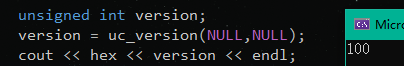

得到版本号1.0.0


### uc_arch_supported

```c
bool uc_arch_supported(uc_arch arch);
```

确定Unicorn是否支持当前架构

```
 @arch: 架构类型 (UC_ARCH_*)
 @return 如果支持返回True
```

<details><summary> 源码实现 </summary>

```c
bool uc_arch_supported(uc_arch arch)
{
    switch (arch) {
#ifdef UNICORN_HAS_ARM
        case UC_ARCH_ARM:   return true;
#endif
#ifdef UNICORN_HAS_ARM64
        case UC_ARCH_ARM64: return true;
#endif
#ifdef UNICORN_HAS_M68K
        case UC_ARCH_M68K:  return true;
#endif
#ifdef UNICORN_HAS_MIPS
        case UC_ARCH_MIPS:  return true;
#endif
#ifdef UNICORN_HAS_PPC
        case UC_ARCH_PPC:   return true;
#endif
#ifdef UNICORN_HAS_SPARC
        case UC_ARCH_SPARC: return true;
#endif
#ifdef UNICORN_HAS_X86
        case UC_ARCH_X86:   return true;
#endif
        /* 无效或禁用架构 */
        default:            return false;
    }
}
```

</details>


使用示例：

```cpp
#include <iostream>
#include "unicorn/unicorn.h"
using namespace std;

int main()
{
    cout << "是否支持UC_ARCH_X86架构：" << uc_arch_supported(UC_ARCH_X86) << endl;
    return 0;
}
```

输出：

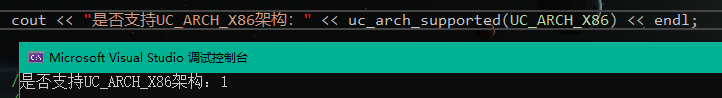


### uc_open

```c
uc_err uc_open(uc_arch arch, uc_mode mode, uc_engine **uc);
```

创建新的Unicorn实例

```
@arch: 架构类型 (UC_ARCH_*)
@mode: 硬件模式. 由 UC_MODE_* 组合
@uc: 指向 uc_engine 的指针, 返回时更新

@return 成功则返回UC_ERR_OK , 否则返回 uc_err 枚举的其他错误类型
```

<details><summary> 源码实现 </summary>

```c
uc_err uc_open(uc_arch arch, uc_mode mode, uc_engine **result)
{
    struct uc_struct *uc;

    if (arch < UC_ARCH_MAX) {
        uc = calloc(1, sizeof(*uc));  //申请内存
        if (!uc) {
            // 内存不足
            return UC_ERR_NOMEM;
        }

        uc->errnum = UC_ERR_OK;
        uc->arch = arch;
        uc->mode = mode;

        // 初始化
        // uc->ram_list = { .blocks = QTAILQ_HEAD_INITIALIZER(ram_list.blocks) };
        uc->ram_list.blocks.tqh_first = NULL;
        uc->ram_list.blocks.tqh_last = &(uc->ram_list.blocks.tqh_first);

        uc->memory_listeners.tqh_first = NULL;
        uc->memory_listeners.tqh_last = &uc->memory_listeners.tqh_first;

        uc->address_spaces.tqh_first = NULL;
        uc->address_spaces.tqh_last = &uc->address_spaces.tqh_first;

        switch(arch) {   // 根据架构进行预处理
            default:
                break;
#ifdef UNICORN_HAS_M68K
            case UC_ARCH_M68K:
                if ((mode & ~UC_MODE_M68K_MASK) ||
                        !(mode & UC_MODE_BIG_ENDIAN)) {
                    free(uc);
                    return UC_ERR_MODE;
                }
                uc->init_arch = m68k_uc_init;
                break;
#endif
#ifdef UNICORN_HAS_X86
            case UC_ARCH_X86:
                if ((mode & ~UC_MODE_X86_MASK) ||
                        (mode & UC_MODE_BIG_ENDIAN) ||
                        !(mode & (UC_MODE_16|UC_MODE_32|UC_MODE_64))) {
                    free(uc);
                    return UC_ERR_MODE;
                }
                uc->init_arch = x86_uc_init;
                break;
#endif
#ifdef UNICORN_HAS_ARM
            case UC_ARCH_ARM:
                if ((mode & ~UC_MODE_ARM_MASK)) {
                    free(uc);
                    return UC_ERR_MODE;
                }
                if (mode & UC_MODE_BIG_ENDIAN) {
                    uc->init_arch = armeb_uc_init;
                } else {
                    uc->init_arch = arm_uc_init;
                }

                if (mode & UC_MODE_THUMB)
                    uc->thumb = 1;
                break;
#endif
#ifdef UNICORN_HAS_ARM64
            case UC_ARCH_ARM64:
                if (mode & ~UC_MODE_ARM_MASK) {
                    free(uc);
                    return UC_ERR_MODE;
                }
                if (mode & UC_MODE_BIG_ENDIAN) {
                    uc->init_arch = arm64eb_uc_init;
                } else {
                    uc->init_arch = arm64_uc_init;
                }
                break;
#endif

#if defined(UNICORN_HAS_MIPS) || defined(UNICORN_HAS_MIPSEL) || defined(UNICORN_HAS_MIPS64) || defined(UNICORN_HAS_MIPS64EL)
            case UC_ARCH_MIPS:
                if ((mode & ~UC_MODE_MIPS_MASK) ||
                        !(mode & (UC_MODE_MIPS32|UC_MODE_MIPS64))) {
                    free(uc);
                    return UC_ERR_MODE;
                }
                if (mode & UC_MODE_BIG_ENDIAN) {
#ifdef UNICORN_HAS_MIPS
                    if (mode & UC_MODE_MIPS32)
                        uc->init_arch = mips_uc_init;
#endif
#ifdef UNICORN_HAS_MIPS64
                    if (mode & UC_MODE_MIPS64)
                        uc->init_arch = mips64_uc_init;
#endif
                } else {    // 小端序
#ifdef UNICORN_HAS_MIPSEL
                    if (mode & UC_MODE_MIPS32)
                        uc->init_arch = mipsel_uc_init;
#endif
#ifdef UNICORN_HAS_MIPS64EL
                    if (mode & UC_MODE_MIPS64)
                        uc->init_arch = mips64el_uc_init;
#endif
                }
                break;
#endif

#ifdef UNICORN_HAS_SPARC
            case UC_ARCH_SPARC:
                if ((mode & ~UC_MODE_SPARC_MASK) ||
                        !(mode & UC_MODE_BIG_ENDIAN) ||
                        !(mode & (UC_MODE_SPARC32|UC_MODE_SPARC64))) {
                    free(uc);
                    return UC_ERR_MODE;
                }
                if (mode & UC_MODE_SPARC64)
                    uc->init_arch = sparc64_uc_init;
                else
                    uc->init_arch = sparc_uc_init;
                break;
#endif
        }

        if (uc->init_arch == NULL) {
            return UC_ERR_ARCH;
        }

        if (machine_initialize(uc))
            return UC_ERR_RESOURCE;

        *result = uc;

        if (uc->reg_reset)
            uc->reg_reset(uc);

        return UC_ERR_OK;
    } else {
        return UC_ERR_ARCH;
    }
}
```

</details>


**注意： uc_open会申请堆内存，使用完必须用uc_close释放，否则会发生泄露**

使用示例：

```cpp
#include <iostream>
#include "unicorn/unicorn.h"
using namespace std;

int main()
{
    uc_engine* uc;
    uc_err err;

    //// 初始化 X86-32bit 模式模拟器
    err = uc_open(UC_ARCH_X86, UC_MODE_32, &uc);
    if (err != UC_ERR_OK) {
        printf("Failed on uc_open() with error returned: %u\n", err);
            return -1;
    }

    if (!err)
        cout << "uc引擎创建成功" << endl;

    //// 关闭uc
    err = uc_close(uc);
    if (err != UC_ERR_OK) {
        printf("Failed on uc_close() with error returned: %u\n", err);
        return -1;
    }

    if (!err)
        cout << "uc引擎关闭成功" << endl;

    return 0;
}
```

输出

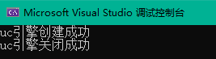


### uc_close

```c
uc_err uc_close(uc_engine *uc);
```

关闭一个uc实例，将释放内存。关闭后无法恢复。

```
@uc: 指向由 uc_open() 返回的指针

@return 成功则返回UC_ERR_OK , 否则返回 uc_err 枚举的其他错误类型
```

<details><summary> 源码实现 </summary>

```c
uc_err uc_close(uc_engine *uc)
{
    int i;
    struct list_item *cur;
    struct hook *hook;

    // 清理内部数据
    if (uc->release)
        uc->release(uc->tcg_ctx);
    g_free(uc->tcg_ctx);

    // 清理 CPU.
    g_free(uc->cpu->tcg_as_listener);
    g_free(uc->cpu->thread);

    // 清理所有 objects.
    OBJECT(uc->machine_state->accelerator)->ref = 1;
    OBJECT(uc->machine_state)->ref = 1;
    OBJECT(uc->owner)->ref = 1;
    OBJECT(uc->root)->ref = 1;

    object_unref(uc, OBJECT(uc->machine_state->accelerator));
    object_unref(uc, OBJECT(uc->machine_state));
    object_unref(uc, OBJECT(uc->cpu));
    object_unref(uc, OBJECT(&uc->io_mem_notdirty));
    object_unref(uc, OBJECT(&uc->io_mem_unassigned));
    object_unref(uc, OBJECT(&uc->io_mem_rom));
    object_unref(uc, OBJECT(uc->root));

    // 释放内存
    g_free(uc->system_memory);

    // 释放相关线程
    if (uc->qemu_thread_data)
        g_free(uc->qemu_thread_data);

    // 释放其他数据
    free(uc->l1_map);

    if (uc->bounce.buffer) {
        free(uc->bounce.buffer);
    }

    g_hash_table_foreach(uc->type_table, free_table, uc);
    g_hash_table_destroy(uc->type_table);

    for (i = 0; i < DIRTY_MEMORY_NUM; i++) {
        free(uc->ram_list.dirty_memory[i]);
    }

    // 释放hook和hook列表
    for (i = 0; i < UC_HOOK_MAX; i++) {
        cur = uc->hook[i].head;
        // hook 可存在于多个列表，可通过计数获取释放的时间
        while (cur) {
            hook = (struct hook *)cur->data;
            if (--hook->refs == 0) {
                free(hook);
            }
            cur = cur->next;
        }
        list_clear(&uc->hook[i]);
    }

    free(uc->mapped_blocks);

    // 最后释放uc自身
    memset(uc, 0, sizeof(*uc));
    free(uc);

    return UC_ERR_OK;
}
```

</details>

使用实例同[uc_open()](#uc_open)


### uc_query

```c
uc_err uc_query(uc_engine *uc, uc_query_type type, size_t *result);
```

查询引擎的内部状态

```
 @uc: uc_open() 返回的句柄
 @type: uc_query_type 中枚举的类型

 @result: 保存被查询的内部状态的指针

 @return: 成功则返回UC_ERR_OK , 否则返回 uc_err 枚举的其他错误类型
```

<details><summary> 源码实现 </summary>

```c
uc_err uc_query(uc_engine *uc, uc_query_type type, size_t *result)
{
    if (type == UC_QUERY_PAGE_SIZE) {
        *result = uc->target_page_size;
        return UC_ERR_OK;
    }

    if (type == UC_QUERY_ARCH) {
        *result = uc->arch;
        return UC_ERR_OK;
    }

    switch(uc->arch) {
#ifdef UNICORN_HAS_ARM
        case UC_ARCH_ARM:
            return uc->query(uc, type, result);
#endif
        default:
            return UC_ERR_ARG;
    }

    return UC_ERR_OK;
}
```

</details>

使用示例：

```cpp
#include <iostream>
#include "unicorn/unicorn.h"
using namespace std;
int main()
{
    uc_engine* uc;
    uc_err err;

    //// Initialize emulator in X86-32bit mode
    err = uc_open(UC_ARCH_X86, UC_MODE_32, &uc);
    if (err != UC_ERR_OK) {
        printf("Failed on uc_open() with error returned: %u\n", err);
        return -1;
    }
    if (!err)
        cout << "uc实例创建成功" << endl;

    size_t result[] = {0};
    err = uc_query(uc, UC_QUERY_ARCH, result);   // 查询架构
    if (!err)
        cout << "查询成功: " << *result << endl;

    err = uc_close(uc);
    if (err != UC_ERR_OK) {
        printf("Failed on uc_close() with error returned: %u\n", err);
        return -1;
    }
    if (!err)
        cout << "uc实例关闭成功" << endl;

    return 0;
}
```

输出

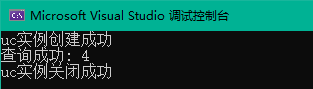

架构查询结果为4，对应的正是UC_ARCH_X86


### uc_errno

```c
uc_err uc_errno(uc_engine *uc);
```

当某个API函数失败时，报告最后的错误号，一旦被访问，uc_errno可能不会保留原来的值。

```
@uc: uc_open() 返回的句柄

@return: 成功则返回UC_ERR_OK , 否则返回 uc_err 枚举的其他错误类型
```

<details><summary> 源码实现 </summary>

```c
uc_err uc_errno(uc_engine *uc)
{
    return uc->errnum;
}
```

</details>

使用示例：

```cpp
#include <iostream>
#include "unicorn/unicorn.h"
using namespace std;

int main()
{
    uc_engine* uc;
    uc_err err;

    err = uc_open(UC_ARCH_X86, UC_MODE_32, &uc);
    if (err != UC_ERR_OK) {
        printf("Failed on uc_open() with error returned: %u\n", err);
        return -1;
    }
    if (!err)
        cout << "uc实例创建成功" << endl;

    err = uc_errno(uc);
    cout << "错误号： " << err << endl;

    err = uc_close(uc);
    if (err != UC_ERR_OK) {
        printf("Failed on uc_close() with error returned: %u\n", err);
        return -1;
    }
    if (!err)
        cout << "uc实例关闭成功" << endl;

    return 0;
}
```

输出

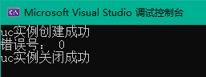

无错误，输出错误号为0


### uc_strerror

```c
const char *uc_strerror(uc_err code);
```

返回给定错误号的解释

```
 @code: 错误号

 @return: 指向给定错误号的解释的字符串指针
```

<details><summary> 源码实现 </summary>

```cpp
const char *uc_strerror(uc_err code)
{
    switch(code) {
        default:
            return "Unknown error code";
        case UC_ERR_OK:
            return "OK (UC_ERR_OK)";
        case UC_ERR_NOMEM:
            return "No memory available or memory not present (UC_ERR_NOMEM)";
        case UC_ERR_ARCH:
            return "Invalid/unsupported architecture (UC_ERR_ARCH)";
        case UC_ERR_HANDLE:
            return "Invalid handle (UC_ERR_HANDLE)";
        case UC_ERR_MODE:
            return "Invalid mode (UC_ERR_MODE)";
        case UC_ERR_VERSION:
            return "Different API version between core & binding (UC_ERR_VERSION)";
        case UC_ERR_READ_UNMAPPED:
            return "Invalid memory read (UC_ERR_READ_UNMAPPED)";
        case UC_ERR_WRITE_UNMAPPED:
            return "Invalid memory write (UC_ERR_WRITE_UNMAPPED)";
        case UC_ERR_FETCH_UNMAPPED:
            return "Invalid memory fetch (UC_ERR_FETCH_UNMAPPED)";
        case UC_ERR_HOOK:
            return "Invalid hook type (UC_ERR_HOOK)";
        case UC_ERR_INSN_INVALID:
            return "Invalid instruction (UC_ERR_INSN_INVALID)";
        case UC_ERR_MAP:
            return "Invalid memory mapping (UC_ERR_MAP)";
        case UC_ERR_WRITE_PROT:
            return "Write to write-protected memory (UC_ERR_WRITE_PROT)";
        case UC_ERR_READ_PROT:
            return "Read from non-readable memory (UC_ERR_READ_PROT)";
        case UC_ERR_FETCH_PROT:
            return "Fetch from non-executable memory (UC_ERR_FETCH_PROT)";
        case UC_ERR_ARG:
            return "Invalid argument (UC_ERR_ARG)";
        case UC_ERR_READ_UNALIGNED:
            return "Read from unaligned memory (UC_ERR_READ_UNALIGNED)";
        case UC_ERR_WRITE_UNALIGNED:
            return "Write to unaligned memory (UC_ERR_WRITE_UNALIGNED)";
        case UC_ERR_FETCH_UNALIGNED:
            return "Fetch from unaligned memory (UC_ERR_FETCH_UNALIGNED)";
        case UC_ERR_RESOURCE:
            return "Insufficient resource (UC_ERR_RESOURCE)";
        case UC_ERR_EXCEPTION:
            return "Unhandled CPU exception (UC_ERR_EXCEPTION)";
        case UC_ERR_TIMEOUT:
            return "Emulation timed out (UC_ERR_TIMEOUT)";
    }
}
```

</details>

使用示例：

```cpp
#include <iostream>
#include "unicorn/unicorn.h"
using namespace std;

int main()
{
    uc_engine* uc;
    uc_err err;

    err = uc_open(UC_ARCH_X86, UC_MODE_32, &uc);
    if (err != UC_ERR_OK) {
        printf("Failed on uc_open() with error returned: %u\n", err);
        return -1;
    }
    if (!err)
        cout << "uc实例创建成功" << endl;

    err = uc_errno(uc);
    cout << "错误号： " << err << "  错误描述： " << uc_strerror(err) <<endl;

    err = uc_close(uc);
    if (err != UC_ERR_OK) {
        printf("Failed on uc_close() with error returned: %u\n", err);
        return -1;
    }
    if (!err)
        cout << "uc实例关闭成功" << endl;

    return 0;
}
```

输出

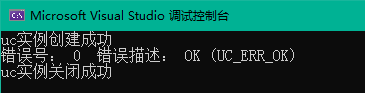


### uc_reg_write

```c
uc_err uc_reg_write(uc_engine *uc, int regid, const void *value);
```

将值写入寄存器

```
@uc: uc_open()返回的句柄
@regid:  将被修改的寄存器ID
@value:  指向寄存器将被修改成的值的指针

@return 成功则返回UC_ERR_OK , 否则返回 uc_err 枚举的其他错误类型
```

<details><summary> 源码实现 </summary>

```c
uc_err uc_reg_write(uc_engine *uc, int regid, const void *value)
{
    return uc_reg_write_batch(uc, &regid, (void *const *)&value, 1);
}

uc_err uc_reg_write_batch(uc_engine *uc, int *ids, void *const *vals, int count)
{
    int ret = UC_ERR_OK;
    if (uc->reg_write)
        ret = uc->reg_write(uc, (unsigned int *)ids, vals, count);    //结构体中写入
    else
        return UC_ERR_EXCEPTION;

    return ret;
}
```

</details>

使用示例：

```cpp
#include <iostream>
#include "unicorn/unicorn.h"
using namespace std;

int main()
{
    uc_engine* uc;
    uc_err err;

    err = uc_open(UC_ARCH_X86, UC_MODE_32, &uc);
    if (err != UC_ERR_OK) {
        printf("Failed on uc_open() with error returned: %u\n", err);
        return -1;
    }
    if (!err)
        cout << "uc实例创建成功" << endl;

    int r_eax = 0x12;
    err = uc_reg_write(uc, UC_X86_REG_ECX, &r_eax);
    if (!err)
        cout << "写入成功: " << r_eax << endl;

    err = uc_close(uc);
    if (err != UC_ERR_OK) {
        printf("Failed on uc_close() with error returned: %u\n", err);
        return -1;
    }
    if (!err)
        cout << "uc实例关闭成功" << endl;

    return 0;
}
```

输出

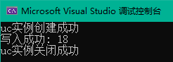


### uc_reg_read

```c
uc_err uc_reg_read(uc_engine *uc, int regid, void *value);
```

读取寄存器的值

```
@uc: uc_open()返回的句柄
@regid:  将被读取的寄存器ID
@value:  指向保存寄存器值的指针

@return 成功则返回UC_ERR_OK , 否则返回 uc_err 枚举的其他错误类型
```

<details><summary> 源码实现 </summary>

```c
uc_err uc_reg_read(uc_engine *uc, int regid, void *value)
{
    return uc_reg_read_batch(uc, &regid, &value, 1);
}

uc_err uc_reg_read_batch(uc_engine *uc, int *ids, void **vals, int count)
{
    if (uc->reg_read)
        uc->reg_read(uc, (unsigned int *)ids, vals, count);
    else
        return -1;

    return UC_ERR_OK;
}
```

</details>

使用示例：

```cpp
#include <iostream>
#include "unicorn/unicorn.h"
using namespace std;

int main()
{
    uc_engine* uc;
    uc_err err;

    err = uc_open(UC_ARCH_X86, UC_MODE_32, &uc);
    if (err != UC_ERR_OK) {
        printf("Failed on uc_open() with error returned: %u\n", err);
        return -1;
    }
    if (!err)
        cout << "uc实例创建成功" << endl;

    int r_eax = 0x12;
    err = uc_reg_write(uc, UC_X86_REG_ECX, &r_eax);
    if (!err)
        cout << "写入成功: " << r_eax << endl;

    int recv_eax;
    err = uc_reg_read(uc, UC_X86_REG_ECX, &recv_eax);
    if (!err)
        cout << "读取成功: " << recv_eax << endl;

    err = uc_close(uc);
    if (err != UC_ERR_OK) {
        printf("Failed on uc_close() with error returned: %u\n", err);
        return -1;
    }
    if (!err)
        cout << "uc实例关闭成功" << endl;

    return 0;
}
```

输出

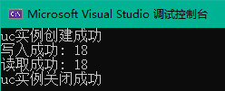


### uc_reg_write_batch

```c
uc_err uc_reg_write_batch(uc_engine *uc, int *regs, void *const *vals, int count);
```

同时将多个值写入多个寄存器

```
@uc: uc_open()返回的句柄
@regid:  存储将被写入的多个寄存器ID的数组
@value:  指向保存多个值的数组的指针
@count: *regs 和 *vals 数组的长度

@return 成功则返回UC_ERR_OK , 否则返回 uc_err 枚举的其他错误类型
```

<details><summary> 源码实现 </summary>

```c
uc_err uc_reg_write_batch(uc_engine *uc, int *ids, void *const *vals, int count)
{
    int ret = UC_ERR_OK;
    if (uc->reg_write)
        ret = uc->reg_write(uc, (unsigned int *)ids, vals, count);
    else
        return UC_ERR_EXCEPTION;

    return ret;
}
```

</details>

使用示例：

```cpp
#include <iostream>
#include <string>
#include "unicorn/unicorn.h"
using namespace std;

int syscall_abi[] = {
    UC_X86_REG_RAX, UC_X86_REG_RDI, UC_X86_REG_RSI, UC_X86_REG_RDX,
    UC_X86_REG_R10, UC_X86_REG_R8, UC_X86_REG_R9
};

uint64_t vals[7] = { 200, 10, 11, 12, 13, 14, 15 };

void* ptrs[7];

int main()
{
    int i;
    uc_err err;
    uc_engine* uc;

    // set up register pointers
    for (i = 0; i < 7; i++) {
        ptrs[i] = &vals[i];
    }

    if ((err = uc_open(UC_ARCH_X86, UC_MODE_64, &uc))) {
        uc_perror("uc_open", err);
        return 1;
    }

    // reg_write_batch
    printf("reg_write_batch({200, 10, 11, 12, 13, 14, 15})\n");
    if ((err = uc_reg_write_batch(uc, syscall_abi, ptrs, 7))) {
        uc_perror("uc_reg_write_batch", err);
        return 1;
    }

    // reg_read_batch
    memset(vals, 0, sizeof(vals));
    if ((err = uc_reg_read_batch(uc, syscall_abi, ptrs, 7))) {
        uc_perror("uc_reg_read_batch", err);
        return 1;
    }

    printf("reg_read_batch = {");

    for (i = 0; i < 7; i++) {
        if (i != 0) printf(", ");
        printf("%" PRIu64, vals[i]);
    }

    printf("}\n");

    uint64_t var[7] = { 0 };
    for (int i = 0; i < 7; i++)
    {
        cout << syscall_abi[i] << "   ";
        printf("%" PRIu64, vals[i]);
        cout << endl;
    }

    return 0;
}
```

输出

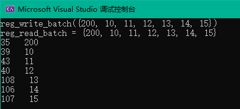


### uc_reg_read_batch

```c
uc_err uc_reg_read_batch(uc_engine *uc, int *regs, void **vals, int count);
```

同时读取多个寄存器的值。

```
@uc: uc_open()返回的句柄
@regid:  存储将被读取的多个寄存器ID的数组
@value:  指向保存多个值的数组的指针
@count: *regs 和 *vals 数组的长度

@return 成功则返回UC_ERR_OK , 否则返回 uc_err 枚举的其他错误类型
```

<details><summary> 源码实现 </summary>

```c
uc_err uc_reg_read_batch(uc_engine *uc, int *ids, void **vals, int count)
{
    if (uc->reg_read)
        uc->reg_read(uc, (unsigned int *)ids, vals, count);
    else
        return -1;

    return UC_ERR_OK;
}
```

</details>

使用示例同uc_reg_write_batch()。


### uc_mem_write

```c
uc_err uc_mem_write(uc_engine *uc, uint64_t address, const void *bytes, size_t size);
```

在内存中写入一段字节码。

```
@uc: uc_open() 返回的句柄
@address: 写入字节的起始地址
@bytes:   指向一个包含要写入内存的数据的指针
@size:   要写入的内存大小。

注意: @bytes 必须足够大以包含 @size 字节。

@return 成功则返回UC_ERR_OK , 否则返回 uc_err 枚举的其他错误类型
```

<details><summary> 源码实现 </summary>

```c
uc_err uc_mem_write(uc_engine *uc, uint64_t address, const void *_bytes, size_t size)
{
    size_t count = 0, len;
    const uint8_t *bytes = _bytes;

    if (uc->mem_redirect) {
        address = uc->mem_redirect(address);
    }

    if (!check_mem_area(uc, address, size))
        return UC_ERR_WRITE_UNMAPPED;

    // 内存区域可以重叠相邻的内存块
    while(count < size) {
        MemoryRegion *mr = memory_mapping(uc, address);
        if (mr) {
            uint32_t operms = mr->perms;
            if (!(operms & UC_PROT_WRITE)) // 没有写保护
                // 标记为可写
                uc->readonly_mem(mr, false);

            len = (size_t)MIN(size - count, mr->end - address);
            if (uc->write_mem(&uc->as, address, bytes, len) == false)
                break;

            if (!(operms & UC_PROT_WRITE)) // 没有写保护
                // 设置写保护
                uc->readonly_mem(mr, true);

            count += len;
            address += len;
            bytes += len;
        } else  // 此地址尚未被映射
            break;
    }

    if (count == size)
        return UC_ERR_OK;
    else
        return UC_ERR_WRITE_UNMAPPED;
}
```

</details>

使用示例：

```cpp
#include <iostream>
#include <string>
#include "unicorn/unicorn.h"
using namespace std;

#define X86_CODE32 "\x41\x4a" // INC ecx; DEC edx
#define ADDRESS 0x1000

int main()
{
    uc_engine* uc;
    uc_err err;

    err = uc_open(UC_ARCH_X86, UC_MODE_32, &uc);
    if (err != UC_ERR_OK) {
        printf("Failed on uc_open() with error returned: %u\n", err);
        return -1;
    }

    uc_mem_map(uc, ADDRESS, 2 * 1024 * 1024, UC_PROT_ALL);

    if (uc_mem_write(uc, ADDRESS, X86_CODE32, sizeof(X86_CODE32) - 1)) {
        printf("Failed to write emulation code to memory, quit!\n");
        return -1;
    }

    uint32_t code;

    if(uc_mem_read(uc,ADDRESS,&code, sizeof(code))) {
        printf("Failed to read emulation code to memory, quit!\n");
        return -1;
    }

    cout << hex << code << endl;

    err = uc_close(uc);
    if (err != UC_ERR_OK) {
        printf("Failed on uc_close() with error returned: %u\n", err);
        return -1;
    }
    return 0;
}
```

输出

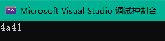


### uc_mem_read

```c
uc_err uc_mem_read(uc_engine *uc, uint64_t address, void *bytes, size_t size);
```

从内存中读取字节。

```
 @uc: uc_open() 返回的句柄
 @address: 读取字节的起始地址
 @bytes:   指向一个包含要读取内存的数据的指针
 @size:   要读取的内存大小。

 注意: @bytes 必须足够大以包含 @size 字节。

@return 成功则返回UC_ERR_OK , 否则返回 uc_err 枚举的其他错误类型
```

<details><summary> 源码实现 </summary>

```c
uc_err uc_mem_read(uc_engine *uc, uint64_t address, void *_bytes, size_t size)
{
    size_t count = 0, len;
    uint8_t *bytes = _bytes;

    if (uc->mem_redirect) {
        address = uc->mem_redirect(address);
    }

    if (!check_mem_area(uc, address, size))
        return UC_ERR_READ_UNMAPPED;

    // 内存区域可以重叠相邻的内存块
    while(count < size) {
        MemoryRegion *mr = memory_mapping(uc, address);
        if (mr) {
            len = (size_t)MIN(size - count, mr->end - address);
            if (uc->read_mem(&uc->as, address, bytes, len) == false)
                break;
            count += len;
            address += len;
            bytes += len;
        } else  // 此地址尚未被映射
            break;
    }

    if (count == size)
        return UC_ERR_OK;
    else
        return UC_ERR_READ_UNMAPPED;
}
```

</details>

使用示例同[uc_mem_write()](#uc_mem_write)


### uc_emu_start

```c
uc_err uc_emu_start(uc_engine *uc, uint64_t begin, uint64_t until, uint64_t timeout, size_t count);
```

在指定的时间内模拟机器码。

```
@uc: uc_open() 返回的句柄
@begin: 开始模拟的地址
@until: 模拟停止的地址 (当到达该地址时)
@timeout: 模拟代码的持续时间(以微秒计)。当这个值为0时，将无时间限制模拟代码，直到模拟完成。
@count: 要模拟的指令数。当这个值为0时，将模拟所有可执行的代码，直到模拟完成

@return 成功则返回UC_ERR_OK , 否则返回 uc_err 枚举的其他错误类型
```

<details><summary> 源码实现 </summary>

```c
uc_err uc_emu_start(uc_engine* uc, uint64_t begin, uint64_t until, uint64_t timeout, size_t count)
{
    // 重制计数器
    uc->emu_counter = 0;
    uc->invalid_error = UC_ERR_OK;
    uc->block_full = false;
    uc->emulation_done = false;
    uc->timed_out = false;

    switch(uc->arch) {
        default:
            break;
#ifdef UNICORN_HAS_M68K
        case UC_ARCH_M68K:
            uc_reg_write(uc, UC_M68K_REG_PC, &begin);
            break;
#endif
#ifdef UNICORN_HAS_X86
        case UC_ARCH_X86:
            switch(uc->mode) {
                default:
                    break;
                case UC_MODE_16: {
                    uint64_t ip;
                    uint16_t cs;

                    uc_reg_read(uc, UC_X86_REG_CS, &cs);
                    // 抵消后面增加的 IP 和 CS
                    ip = begin - cs*16;
                    uc_reg_write(uc, UC_X86_REG_IP, &ip);
                    break;
                }
                case UC_MODE_32:
                    uc_reg_write(uc, UC_X86_REG_EIP, &begin);
                    break;
                case UC_MODE_64:
                    uc_reg_write(uc, UC_X86_REG_RIP, &begin);
                    break;
            }
            break;
#endif
#ifdef UNICORN_HAS_ARM
        case UC_ARCH_ARM:
            uc_reg_write(uc, UC_ARM_REG_R15, &begin);
            break;
#endif
#ifdef UNICORN_HAS_ARM64
        case UC_ARCH_ARM64:
            uc_reg_write(uc, UC_ARM64_REG_PC, &begin);
            break;
#endif
#ifdef UNICORN_HAS_MIPS
        case UC_ARCH_MIPS:
            // TODO: MIPS32/MIPS64/BIGENDIAN etc
            uc_reg_write(uc, UC_MIPS_REG_PC, &begin);
            break;
#endif
#ifdef UNICORN_HAS_SPARC
        case UC_ARCH_SPARC:
            // TODO: Sparc/Sparc64
            uc_reg_write(uc, UC_SPARC_REG_PC, &begin);
            break;
#endif
    }

    uc->stop_request = false;

    uc->emu_count = count;
    // 如果不需要计数，则移除计数挂钩hook
    if (count <= 0 && uc->count_hook != 0) {
        uc_hook_del(uc, uc->count_hook);
        uc->count_hook = 0;
    }
    // 设置计数hook记录指令数
    if (count > 0 && uc->count_hook == 0) {
        uc_err err;
        // 对计数指令的回调必须在所有其他操作之前运行，因此必须在hook列表的开头插入hook，而不是附加hook
        uc->hook_insert = 1;
        err = uc_hook_add(uc, &uc->count_hook, UC_HOOK_CODE, hook_count_cb, NULL, 1, 0);
        // 恢复到 uc_hook_add()
        uc->hook_insert = 0;
        if (err != UC_ERR_OK) {
            return err;
        }
    }

    uc->addr_end = until;

    if (timeout)
        enable_emu_timer(uc, timeout * 1000);   // microseconds -> nanoseconds

    if (uc->vm_start(uc)) {
        return UC_ERR_RESOURCE;
    }

    // 模拟完成
    uc->emulation_done = true;

    if (timeout) {
        // 等待超时
        qemu_thread_join(&uc->timer);
    }

    if(uc->timed_out)
        return UC_ERR_TIMEOUT;

    return uc->invalid_error;
}
```

</details>

使用示例：

```cpp
#include <iostream>
#include <string>
#include "unicorn/unicorn.h"
using namespace std;

#define X86_CODE32 "\x33\xC0" // xor  eax, eax
#define ADDRESS 0x1000

int main()
{
    uc_engine* uc;
    uc_err err;

    int r_eax = 0x111;

    err = uc_open(UC_ARCH_X86, UC_MODE_32, &uc);
    if (err != UC_ERR_OK) {
        printf("Failed on uc_open() with error returned: %u\n", err);
        return -1;
    }

    uc_mem_map(uc, ADDRESS, 2 * 1024 * 1024, UC_PROT_ALL);

    if (uc_mem_write(uc, ADDRESS, X86_CODE32, sizeof(X86_CODE32) - 1)) {
        printf("Failed to write emulation code to memory, quit!\n");
        return -1;
    }

    uc_reg_write(uc, UC_X86_REG_EAX, &r_eax);
    printf(">>> before EAX = 0x%x\n", r_eax);

    err = uc_emu_start(uc, ADDRESS, ADDRESS + sizeof(X86_CODE32) - 1, 0, 0);
    if (err) {
        printf("Failed on uc_emu_start() with error returned %u: %s\n",
        err, uc_strerror(err));
    }

    uc_reg_read(uc, UC_X86_REG_EAX, &r_eax);
    printf(">>> after EAX = 0x%x\n", r_eax);

    err = uc_close(uc);
    if (err != UC_ERR_OK) {
        printf("Failed on uc_close() with error returned: %u\n", err);
        return -1;
    }

    return 0;
}
```

输出

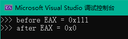


### uc_emu_stop

```c
uc_err uc_emu_stop(uc_engine *uc);
```

停止模拟

通常是从通过 tracing API注册的回调函数中调用。

```
@uc: uc_open() 返回的句柄

@return 成功则返回UC_ERR_OK , 否则返回 uc_err 枚举的其他错误类型
```

<details><summary> 源码实现 </summary>

```c
uc_err uc_emu_stop(uc_engine *uc)
{
    if (uc->emulation_done)
        return UC_ERR_OK;

    uc->stop_request = true;

    if (uc->current_cpu) {
        // 退出当前线程
        cpu_exit(uc->current_cpu);
    }

    return UC_ERR_OK;
}
```

</details>

使用示例：

```cpp
uc_emu_stop(uc);
```


### uc_hook_add

```c
uc_err uc_hook_add(uc_engine *uc, uc_hook *hh, int type, void *callback,
        void *user_data, uint64_t begin, uint64_t end, ...);
```

注册hook事件的回调，当hook事件被触发将会进行回调。

```
 @uc: uc_open() 返回的句柄
 @hh: 注册hook得到的句柄. uc_hook_del() 中使用
 @type: hook 类型
 @callback: 当指令被命中时要运行的回调
 @user_data: 用户自定义数据. 将被传递给回调函数的最后一个参数 @user_data
 @begin: 回调生效区域的起始地址(包括)
 @end: 回调生效区域的结束地址(包括)
   注意 1: 只有回调的地址在[@begin, @end]中才会调用回调
   注意 2: 如果 @begin > @end, 每当触发此hook类型时都会调用回调
 @...: 变量参数 (取决于 @type)
   注意: 如果 @type = UC_HOOK_INSN, 这里是指令ID (如: UC_X86_INS_OUT)

 @return 成功则返回UC_ERR_OK , 否则返回 uc_err 枚举的其他错误类型
```

<details><summary> 源码实现 </summary>

```c
uc_err uc_hook_add(uc_engine *uc, uc_hook *hh, int type, void *callback,
        void *user_data, uint64_t begin, uint64_t end, ...)
{
    int ret = UC_ERR_OK;
    int i = 0;

    struct hook *hook = calloc(1, sizeof(struct hook));
    if (hook == NULL) {
        return UC_ERR_NOMEM;
    }

    hook->begin = begin;
    hook->end = end;
    hook->type = type;
    hook->callback = callback;
    hook->user_data = user_data;
    hook->refs = 0;
    *hh = (uc_hook)hook;

    // UC_HOOK_INSN 有一个额外参数：指令ID
    if (type & UC_HOOK_INSN) {
        va_list valist;

        va_start(valist, end);
        hook->insn = va_arg(valist, int);
        va_end(valist);

        if (uc->insn_hook_validate) {
            if (! uc->insn_hook_validate(hook->insn)) {
                free(hook);
                return UC_ERR_HOOK;
            }
        }

        if (uc->hook_insert) {
            if (list_insert(&uc->hook[UC_HOOK_INSN_IDX], hook) == NULL) {
                free(hook);
                return UC_ERR_NOMEM;
            }
        } else {
            if (list_append(&uc->hook[UC_HOOK_INSN_IDX], hook) == NULL) {
                free(hook);
                return UC_ERR_NOMEM;
            }
        }

        hook->refs++;
        return UC_ERR_OK;
    }

    while ((type >> i) > 0) {
        if ((type >> i) & 1) {
            if (i < UC_HOOK_MAX) {
                if (uc->hook_insert) {
                    if (list_insert(&uc->hook[i], hook) == NULL) {
                        if (hook->refs == 0) {
                            free(hook);
                        }
                        return UC_ERR_NOMEM;
                    }
                } else {
                    if (list_append(&uc->hook[i], hook) == NULL) {
                        if (hook->refs == 0) {
                            free(hook);
                        }
                        return UC_ERR_NOMEM;
                    }
                }
                hook->refs++;
            }
        }
        i++;
    }

    if (hook->refs == 0) {
        free(hook);
    }

    return ret;
}
```

</details>

使用示例：

```cpp
#include <iostream>
#include <string>
#include "unicorn/unicorn.h"
using namespace std;

int syscall_abi[] = {
    UC_X86_REG_RAX, UC_X86_REG_RDI, UC_X86_REG_RSI, UC_X86_REG_RDX,
    UC_X86_REG_R10, UC_X86_REG_R8, UC_X86_REG_R9
};

uint64_t vals[7] = { 200, 10, 11, 12, 13, 14, 15 };

void* ptrs[7];

void uc_perror(const char* func, uc_err err)
{
    fprintf(stderr, "Error in %s(): %s\n", func, uc_strerror(err));
}

#define BASE 0x10000

// mov rax, 100; mov rdi, 1; mov rsi, 2; mov rdx, 3; mov r10, 4; mov r8, 5; mov r9, 6; syscall
#define CODE "\x48\xc7\xc0\x64\x00\x00\x00\x48\xc7\xc7\x01\x00\x00\x00\x48\xc7\xc6\x02\x00\x00\x00\x48\xc7\xc2\x03\x00\x00\x00\x49\xc7\xc2\x04\x00\x00\x00\x49\xc7\xc0\x05\x00\x00\x00\x49\xc7\xc1\x06\x00\x00\x00\x0f\x05"

void hook_syscall(uc_engine* uc, void* user_data)
{
    int i;

    uc_reg_read_batch(uc, syscall_abi, ptrs, 7);

    printf("syscall: {");

    for (i = 0; i < 7; i++) {
        if (i != 0) printf(", ");
        printf("%" PRIu64, vals[i]);
    }

    printf("}\n");
}

void hook_code(uc_engine* uc, uint64_t addr, uint32_t size, void* user_data)
{
    printf("HOOK_CODE: 0x%" PRIx64 ", 0x%x\n", addr, size);
}

int main()
{
    int i;
    uc_hook sys_hook;
    uc_err err;
    uc_engine* uc;

    for (i = 0; i < 7; i++) {
        ptrs[i] = &vals[i];
    }

    if ((err = uc_open(UC_ARCH_X86, UC_MODE_64, &uc))) {
        uc_perror("uc_open", err);
        return 1;
    }

    printf("reg_write_batch({200, 10, 11, 12, 13, 14, 15})\n");
    if ((err = uc_reg_write_batch(uc, syscall_abi, ptrs, 7))) {
        uc_perror("uc_reg_write_batch", err);
        return 1;
    }

    memset(vals, 0, sizeof(vals));
    if ((err = uc_reg_read_batch(uc, syscall_abi, ptrs, 7))) {
        uc_perror("uc_reg_read_batch", err);
        return 1;
    }

    printf("reg_read_batch = {");

    for (i = 0; i < 7; i++) {
        if (i != 0) printf(", ");
        printf("%" PRIu64, vals[i]);
    }

    printf("}\n");

    // syscall
    printf("\n");
    printf("running syscall shellcode\n");

    if ((err = uc_hook_add(uc, &sys_hook, UC_HOOK_CODE, hook_syscall, NULL, 1, 0))) {
        uc_perror("uc_hook_add", err);
        return 1;
    }

    if ((err = uc_mem_map(uc, BASE, 0x1000, UC_PROT_ALL))) {
        uc_perror("uc_mem_map", err);
        return 1;
    }

    if ((err = uc_mem_write(uc, BASE, CODE, sizeof(CODE) - 1))) {
        uc_perror("uc_mem_write", err);
        return 1;
    }

    if ((err = uc_emu_start(uc, BASE, BASE + sizeof(CODE) - 1, 0, 0))) {
        uc_perror("uc_emu_start", err);
        return 1;
    }

    return 0;
}
```

输出

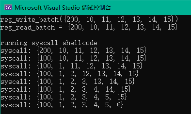

对每条指令都进行hook


### uc_hook_del

```
uc_err uc_hook_del(uc_engine *uc, uc_hook hh);
```

删除一个已注册的hook事件

```
@uc: uc_open() 返回的句柄
@hh: uc_hook_add() 返回的句柄

@return 成功则返回UC_ERR_OK , 否则返回 uc_err 枚举的其他错误类型
```

<details><summary> 源码实现 </summary>

```c
uc_err uc_hook_del(uc_engine *uc, uc_hook hh)
{
    int i;
    struct hook *hook = (struct hook *)hh;

    for (i = 0; i < UC_HOOK_MAX; i++) {
        if (list_remove(&uc->hook[i], (void *)hook)) {
            if (--hook->refs == 0) {
                free(hook);
                break;
            }
        }
    }
    return UC_ERR_OK;
}
```

</details>

使用示例：

```cpp
if ((err = uc_hook_add(uc, &sys_hook, UC_HOOK_CODE, hook_syscall, NULL, 1, 0))) {
    uc_perror("uc_hook_add", err);
    return 1;
}

if ((err = uc_hook_del(uc, &sys_hook))) {
    uc_perror("uc_hook_del", err);
    return 1;
}
```


### uc_mem_map

```c
uc_err uc_mem_map(uc_engine *uc, uint64_t address, size_t size, uint32_t perms);
```

为模拟映射一块内存。

```
@uc: uc_open() 返回的句柄
@address: 要映射到的新内存区域的起始地址。这个地址必须与4KB对齐，否则将返回UC_ERR_ARG错误。
@size: 要映射到的新内存区域的大小。这个大小必须是4KB的倍数，否则将返回UC_ERR_ARG错误。
@perms: 新映射区域的权限。参数必须是UC_PROT_READ | UC_PROT_WRITE | UC_PROT_EXEC或这些的组合，否则返回UC_ERR_ARG错误。

@return 成功则返回UC_ERR_OK , 否则返回 uc_err 枚举的其他错误类型
```

<details><summary> 源码实现 </summary>

```c
uc_err uc_mem_map(uc_engine *uc, uint64_t address, size_t size, uint32_t perms)
{
    uc_err res;

    if (uc->mem_redirect) {
        address = uc->mem_redirect(address);
    }

    res = mem_map_check(uc, address, size, perms);    //内存安全检查
    if (res)
        return res;

    return mem_map(uc, address, size, perms, uc->memory_map(uc, address, size, perms));
}
```

</details>

使用示例同 [uc_hook_add()](#uc_hook_add)


### uc_mem_map_ptr

```c
uc_err uc_mem_map_ptr(uc_engine *uc, uint64_t address, size_t size, uint32_t perms, void *ptr);
```

在模拟中映射现有的主机内存。

```
@uc: uc_open() 返回的句柄
@address: 要映射到的新内存区域的起始地址。这个地址必须与4KB对齐，否则将返回UC_ERR_ARG错误。
@size: 要映射到的新内存区域的大小。这个大小必须是4KB的倍数，否则将返回UC_ERR_ARG错误。
@perms: 新映射区域的权限。参数必须是UC_PROT_READ | UC_PROT_WRITE | UC_PROT_EXEC或这些的组合，否则返回UC_ERR_ARG错误。
@ptr: 指向支持新映射内存的主机内存的指针。映射的主机内存的大小应该与size的大小相同或更大，并且至少使用PROT_READ | PROT_WRITE进行映射，否则不定义映射。

@return 成功则返回UC_ERR_OK , 否则返回 uc_err 枚举的其他错误类型
```

<details><summary> 源码实现 </summary>

```c
uc_err uc_mem_map_ptr(uc_engine *uc, uint64_t address, size_t size, uint32_t perms, void *ptr)
{
    uc_err res;

    if (ptr == NULL)
        return UC_ERR_ARG;

    if (uc->mem_redirect) {
        address = uc->mem_redirect(address);
    }

    res = mem_map_check(uc, address, size, perms);    //内存安全检查
    if (res)
        return res;

    return mem_map(uc, address, size, UC_PROT_ALL, uc->memory_map_ptr(uc, address, size, perms, ptr));
}
```

</details>

使用示例同 [uc_mem_map()](#uc_mem_map)


### uc_mem_unmap

```c
uc_err uc_mem_unmap(uc_engine *uc, uint64_t address, size_t size);
```

取消对模拟内存区域的映射

```
@uc: uc_open() 返回的句柄
@address: 要映射到的新内存区域的起始地址。这个地址必须与4KB对齐，否则将返回UC_ERR_ARG错误。
@size: 要映射到的新内存区域的大小。这个大小必须是4KB的倍数，否则将返回UC_ERR_ARG错误。

@return 成功则返回UC_ERR_OK , 否则返回 uc_err 枚举的其他错误类型
```

<details><summary> 源码实现 </summary>

```c
uc_err uc_mem_unmap(struct uc_struct *uc, uint64_t address, size_t size)
{
    MemoryRegion *mr;
    uint64_t addr;
    size_t count, len;

    if (size == 0)
        // 没有要取消映射的区域
        return UC_ERR_OK;

    // 地址必须对齐到 uc->target_page_size
    if ((address & uc->target_page_align) != 0)
        return UC_ERR_ARG;

    // 大小必须是 uc->target_page_size 的倍数
    if ((size & uc->target_page_align) != 0)
        return UC_ERR_ARG;

    if (uc->mem_redirect) {
        address = uc->mem_redirect(address);
    }

    // 检查用户请求的整个块是否被映射
    if (!check_mem_area(uc, address, size))
        return UC_ERR_NOMEM;

    // 如果这个区域跨越了相邻的区域，可能需要分割区域
    addr = address;
    count = 0;
    while(count < size) {
        mr = memory_mapping(uc, addr);
        len = (size_t)MIN(size - count, mr->end - addr);
        if (!split_region(uc, mr, addr, len, true))
            return UC_ERR_NOMEM;

        // 取消映射
        mr = memory_mapping(uc, addr);
        if (mr != NULL)
           uc->memory_unmap(uc, mr);
        count += len;
        addr += len;
    }

    return UC_ERR_OK;
}
```

</details>

使用示例：

```cpp
if ((err = uc_mem_map(uc, BASE, 0x1000, UC_PROT_ALL))) {
    uc_perror("uc_mem_map", err);
    return 1;
}

if ((err = uc_mem_unmap(uc, BASE, 0x1000))) {
    uc_perror("uc_mem_unmap", err);
    return 1;
}
```


### uc_mem_protect

```c
uc_err uc_mem_protect(uc_engine *uc, uint64_t address, size_t size, uint32_t perms);
```

设置模拟内存的权限

```
@uc: uc_open() 返回的句柄
@address: 要映射到的新内存区域的起始地址。这个地址必须与4KB对齐，否则将返回UC_ERR_ARG错误。
@size: 要映射到的新内存区域的大小。这个大小必须是4KB的倍数，否则将返回UC_ERR_ARG错误。
@perms: 映射区域的新权限。参数必须是UC_PROT_READ | UC_PROT_WRITE | UC_PROT_EXEC或这些的组合，否则返回UC_ERR_ARG错误。

@return 成功则返回UC_ERR_OK , 否则返回 uc_err 枚举的其他错误类型
```

<details><summary> 源码实现 </summary>

```c
uc_err uc_mem_protect(struct uc_struct *uc, uint64_t address, size_t size, uint32_t perms)
{
    MemoryRegion *mr;
    uint64_t addr = address;
    size_t count, len;
    bool remove_exec = false;

    if (size == 0)
        // trivial case, no change
        return UC_ERR_OK;

    // address must be aligned to uc->target_page_size
    if ((address & uc->target_page_align) != 0)
        return UC_ERR_ARG;

    // size must be multiple of uc->target_page_size
    if ((size & uc->target_page_align) != 0)
        return UC_ERR_ARG;

    // check for only valid permissions
    if ((perms & ~UC_PROT_ALL) != 0)
        return UC_ERR_ARG;

    if (uc->mem_redirect) {
        address = uc->mem_redirect(address);
    }

    // check that user's entire requested block is mapped
    if (!check_mem_area(uc, address, size))
        return UC_ERR_NOMEM;

    // Now we know entire region is mapped, so change permissions
    // We may need to split regions if this area spans adjacent regions
    addr = address;
    count = 0;
    while(count < size) {
        mr = memory_mapping(uc, addr);
        len = (size_t)MIN(size - count, mr->end - addr);
        if (!split_region(uc, mr, addr, len, false))
            return UC_ERR_NOMEM;

        mr = memory_mapping(uc, addr);
        // will this remove EXEC permission?
        if (((mr->perms & UC_PROT_EXEC) != 0) && ((perms & UC_PROT_EXEC) == 0))
            remove_exec = true;
        mr->perms = perms;
        uc->readonly_mem(mr, (perms & UC_PROT_WRITE) == 0);

        count += len;
        addr += len;
    }

    // if EXEC permission is removed, then quit TB and continue at the same place
    if (remove_exec) {
        uc->quit_request = true;
        uc_emu_stop(uc);
    }

    return UC_ERR_OK;
}
```

</details>

使用示例：

```cpp
if ((err = uc_mem_protect(uc, BASE, 0x1000, UC_PROT_ALL))) {  //可读可写可执行
    uc_perror("uc_mem_protect", err);
    return 1;
}
```


### uc_mem_regions

```c
uc_err uc_mem_regions(uc_engine *uc, uc_mem_region **regions, uint32_t *count);
```

检索由 uc_mem_map() 和 uc_mem_map_ptr() 映射的内存的信息。

这个API为@regions分配内存，用户之后必须通过free()释放这些内存来避免内存泄漏。

```
@uc: uc_open() 返回的句柄
@regions: 指向 uc_mem_region 结构体的数组的指针. 由Unicorn申请，必须通过uc_free()释放这些内存
@count: 指向@regions中包含的uc_mem_region结构体的数量的指针

@return 成功则返回UC_ERR_OK , 否则返回 uc_err 枚举的其他错误类型
```

源码分析

<details><summary> Code </summary>

```c
uint32_t uc_mem_regions(uc_engine *uc, uc_mem_region **regions, uint32_t *count)
{
    uint32_t i;
    uc_mem_region *r = NULL;

    *count = uc->mapped_block_count;

    if (*count) {
        r = g_malloc0(*count * sizeof(uc_mem_region));
        if (r == NULL) {
            // 内存不足
            return UC_ERR_NOMEM;
        }
    }

    for (i = 0; i < *count; i++) {
        r[i].begin = uc->mapped_blocks[i]->addr;
        r[i].end = uc->mapped_blocks[i]->end - 1;
        r[i].perms = uc->mapped_blocks[i]->perms;
    }

    *regions = r;

    return UC_ERR_OK;
}
```

</details>

使用示例：

```cpp
#include <iostream>
#include <string>
#include "unicorn/unicorn.h"
using namespace std;

int main()
{
    uc_err err;
    uc_engine* uc;

    if ((err = uc_open(UC_ARCH_X86, UC_MODE_64, &uc))) {
        uc_perror("uc_open", err);
        return 1;
    }

    if ((err = uc_mem_map(uc, BASE, 0x1000, UC_PROT_ALL))) {
        uc_perror("uc_mem_map", err);
        return 1;
    }

    uc_mem_region *region;
    uint32_t count;

    if ((err = uc_mem_regions(uc, &region, &count))) {
        uc_perror("uc_mem_regions", err);
        return 1;
    }

    cout << "起始地址： 0x" << hex << region->begin << "  结束地址： 0x" << hex << region->end << "  内存权限：  " <<region->perms << "  已申请内存块数： " << count << endl;

    if ((err = uc_free(region))) {    ////注意释放内存
        uc_perror("uc_free", err);
        return 1;
    }

    return 0;
}
```

输出


### uc_free

```c
uc_err uc_free(void *mem);
```

释放由 [uc_mem_regions()](#uc_mem_regions) 申请的内存

```
@mem: 由 uc_mem_regions (返回 *regions)申请的内存

@return 成功则返回UC_ERR_OK , 否则返回 uc_err 枚举的其他错误类型
```

<details><summary> 源码实现 </summary>

```c
uc_err uc_free(void *mem)
{
    g_free(mem);
    return UC_ERR_OK;
}

void g_free(gpointer ptr)
{
   free(ptr);
}
```

</details>

使用示例同 [uc_mem_regions()](#uc_mem_regions)


### uc_context_alloc

```c
uc_err uc_context_alloc(uc_engine *uc, uc_context **context);
```

分配一个可以与uc_context_{save,restore}一起使用的区域来执行CPU上下文的快速保存/回滚，包括寄存器和内部元数据。上下文不能在具有不同架构或模式的引擎实例之间共享。

```
@uc: uc_open() 返回的句柄
@context: 指向uc_engine*的指针。当这个函数成功返回时，将使用指向新上下文的指针更新它。之后必须使用uc_context_free()释放这些分配的内存。

@return 成功则返回UC_ERR_OK , 否则返回 uc_err 枚举的其他错误类型
```

<details><summary> 源码实现 </summary>

```c
uc_err uc_context_alloc(uc_engine *uc, uc_context **context)
{
    struct uc_context **_context = context;
    size_t size = uc->cpu_context_size;

    *_context = g_malloc(size);
    if (*_context) {
        (*_context)->jmp_env_size = sizeof(*uc->cpu->jmp_env);
        (*_context)->context_size = size - sizeof(uc_context) - (*_context)->jmp_env_size;
        return UC_ERR_OK;
    } else {
        return UC_ERR_NOMEM;
    }
}
```

</details>

使用示例

```cpp
#include <iostream>
#include <string>
#include "unicorn/unicorn.h"
using namespace std;

#define ADDRESS 0x1000
#define X86_CODE32_INC "\x40"   // INC eax

int main()
{
    uc_engine* uc;
    uc_context* context;
    uc_err err;

    int r_eax = 0x1;    // EAX 寄存器

    printf("===================================\n");
    printf("Save/restore CPU context in opaque blob\n");

    err = uc_open(UC_ARCH_X86, UC_MODE_32, &uc);
    if (err) {
        printf("Failed on uc_open() with error returned: %u\n", err);
        return 0;
    }

    uc_mem_map(uc, ADDRESS, 8 * 1024, UC_PROT_ALL);

    if (uc_mem_write(uc, ADDRESS, X86_CODE32_INC, sizeof(X86_CODE32_INC) - 1)) {
        printf("Failed to write emulation code to memory, quit!\n");
        return 0;
    }

    // 初始化寄存器
    uc_reg_write(uc, UC_X86_REG_EAX, &r_eax);

    printf(">>> Running emulation for the first time\n");

    err = uc_emu_start(uc, ADDRESS, ADDRESS + sizeof(X86_CODE32_INC) - 1, 0, 0);
    if (err) {
        printf("Failed on uc_emu_start() with error returned %u: %s\n",
            err, uc_strerror(err));
    }

    printf(">>> Emulation done. Below is the CPU context\n");

    uc_reg_read(uc, UC_X86_REG_EAX, &r_eax);
    printf(">>> EAX = 0x%x\n", r_eax);

    // 申请并保存 CPU 上下文
    printf(">>> Saving CPU context\n");

    err = uc_context_alloc(uc, &context);
    if (err) {
        printf("Failed on uc_context_alloc() with error returned: %u\n", err);
        return 0;
    }

    err = uc_context_save(uc, context);
    if (err) {
        printf("Failed on uc_context_save() with error returned: %u\n", err);
        return 0;
    }

    printf(">>> Running emulation for the second time\n");

    err = uc_emu_start(uc, ADDRESS, ADDRESS + sizeof(X86_CODE32_INC) - 1, 0, 0);
    if (err) {
        printf("Failed on uc_emu_start() with error returned %u: %s\n",
            err, uc_strerror(err));
    }

    printf(">>> Emulation done. Below is the CPU context\n");

    uc_reg_read(uc, UC_X86_REG_EAX, &r_eax);
    printf(">>> EAX = 0x%x\n", r_eax);

    // 恢复 CPU 上下文
    err = uc_context_restore(uc, context);
    if (err) {
        printf("Failed on uc_context_restore() with error returned: %u\n", err);
        return 0;
    }

    printf(">>> CPU context restored. Below is the CPU context\n");

    uc_reg_read(uc, UC_X86_REG_EAX, &r_eax);
    printf(">>> EAX = 0x%x\n", r_eax);

    // 释放 CPU 上下文
    err = uc_context_free(context);
    if (err) {
        printf("Failed on uc_free() with error returned: %u\n", err);
        return;
    }

    uc_close(uc);
}
```

输出

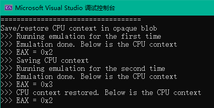


### uc_context_save

```c
uc_err uc_context_save(uc_engine *uc, uc_context *context);
```

保存当前CPU上下文

```
@uc: uc_open() 返回的句柄
@context: uc_context_alloc() 返回的句柄

@return 成功则返回UC_ERR_OK , 否则返回 uc_err 枚举的其他错误类型
```

<details><summary> 源码实现 </summary>

```c
uc_err uc_context_save(uc_engine *uc, uc_context *context)
{
    struct uc_context *_context = context;
    memcpy(_context->data, uc->cpu->env_ptr, _context->size);
    return UC_ERR_OK;
}
```

</details>

使用示例同 [uc_context_alloc()](#uc_context_alloc)


### uc_context_restore

```c
uc_err uc_context_restore(uc_engine *uc, uc_context *context);
```

恢复已保存的CPU上下文

```
@uc: uc_open() 返回的句柄
@context: uc_context_alloc() 返回并且已使用 uc_context_save 保存的句柄

@return 成功则返回UC_ERR_OK , 否则返回 uc_err 枚举的其他错误类型
```

<details><summary> 源码实现 </summary>

```c
uc_err uc_context_restore(uc_engine *uc, uc_context *context)
{
    struct uc_context *_context = context;
    memcpy(uc->cpu->env_ptr, _context->data, _context->size);
    return UC_ERR_OK;
}
```

</details>

使用示例同 [uc_context_alloc()](#uc_context_alloc)


### uc_context_size

```c
size_t uc_context_size(uc_engine *uc);
```

返回存储cpu上下文所需的大小。可以用来分配一个缓冲区来包含cpu上下文，并直接调用uc_context_save。

```
@uc: uc_open() 返回的句柄

@return 存储cpu上下文所需的大小，类型为 size_t.
```


<details><summary> 源码实现 </summary>

```c
size_t uc_context_size(uc_engine *uc)
{
    return sizeof(uc_context) + uc->cpu_context_size + sizeof(*uc->cpu->jmp_env);
}
```

</details>

使用示例同 [uc_context_alloc()](#uc_context_alloc)


### uc_context_free

```c
uc_err uc_context_free(uc_context *context);
```

释放由 [uc_context_alloc()](#uc_context_alloc) 申请的内存

```
@context: 由uc_context_alloc创建的uc_context

@return 成功则返回UC_ERR_OK , 否则返回 uc_err 枚举的其他错误类型
```

使用示例同 [uc_context_alloc()](#uc_context_alloc)